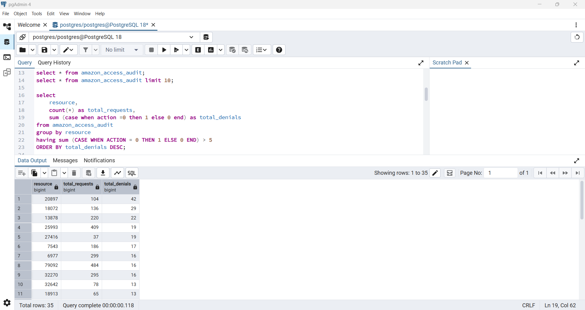
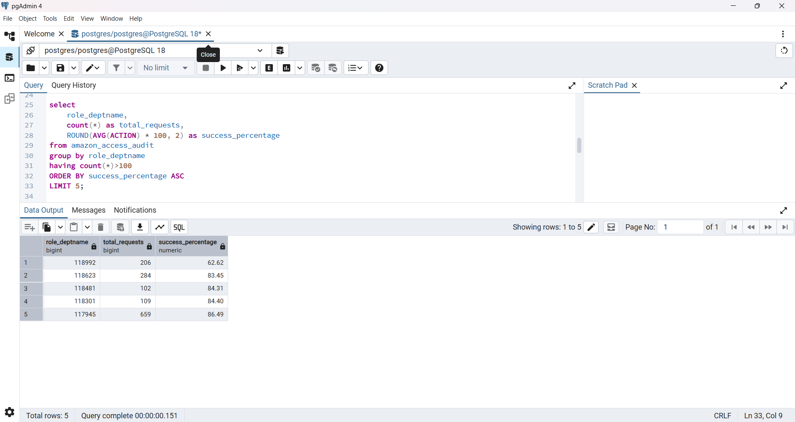
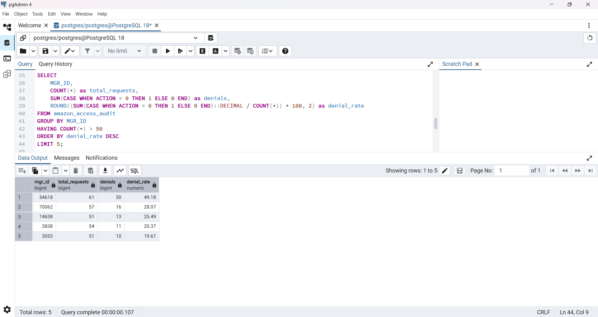
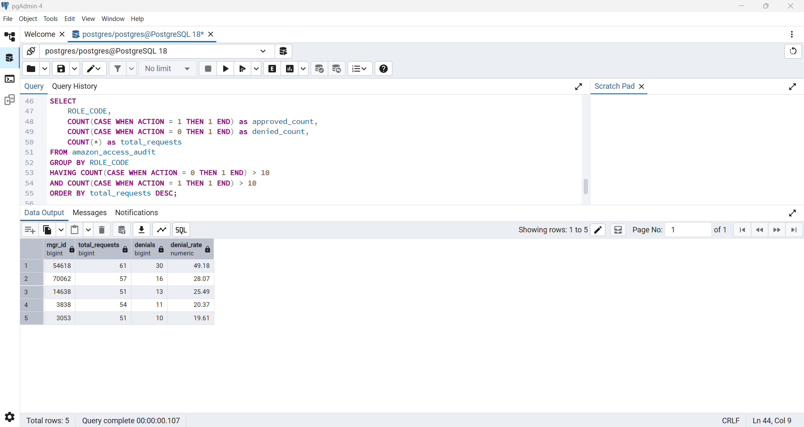

# 📁 Systems Access & Entitlement Audit (RBAC Analysis)

## 🧩 Project Overview  
This project simulates a real-world systems access audit to analyze how employee access requests are approved or denied. The goal is to identify patterns that may indicate inefficiencies, inconsistencies, or potential risks in Role-Based Access Control (RBAC).

---

## 🎯 Business Objective  
To support operational efficiency and audit readiness by:
- Analyzing access request trends  
- Identifying high-risk systems and departments  
- Highlighting inconsistencies in approval decisions  

---

## 📊 Dataset  
- Source: Amazon Employee Access Dataset  
- Size: 32,000+ records  
- Focus: Employee access requests and approval/denial outcomes  

> Note: Dataset not included due to size. Public dataset used.

---

## 🔍 Key Findings  

- Identified a system (ID: 20897) with ~40% access denial rate, indicating possible mismatch in role-based access criteria  

- Found that Department 118992 had a lower approval rate (~62.6%) compared to the overall average, suggesting potential access configuration issues  

- Observed certain managers (e.g., Manager ID: 54618) with high denial rates (~50%), highlighting inconsistency in approval patterns  

---

## 🛠️ My Approach  

- Explored the dataset using SQL to understand access request patterns  
- Used GROUP BY and aggregation to analyze approval and denial trends  
- Applied CASE WHEN logic to interpret outcomes and categorize results  
- Analyzed patterns across systems, departments, and managers  
- Interpreted findings from an audit and risk perspective  

---

## 📊 Visual Insights  

### 🔹 Resource Access Risk  

### 🔹 Department Success Rates  

### 🔹 Manager Denial Patterns  

### 🔹 Role Code Inconsistency  

---

## 💡 Business Impact  

- Helps improve access control policies  
- Supports audit and compliance processes  
- Identifies areas for role and permission optimization  
- Reduces risk of unauthorized or inefficient access  

---

## ⚙️ Tools & Skills Used  

- SQL (Aggregation, Conditional Logic, Data Analysis)  
- Data Interpretation  
- Risk & Audit Thinking  
- Attention to Detail  

---

## 📂 Project Structure  

- access_audit_queries.sql – SQL queries used for analysis  
- *.png – Visual insights from analysis  
- README.md – Project documentation  

---

## ✅ Conclusion  

This analysis highlights how access control patterns can reveal inefficiencies in role-based systems. By identifying high denial rates and inconsistencies, organizations can improve access policies, reduce risk, and strengthen audit readiness.

---

## 📌 Note  
This is a simulated project created for learning purposes using a publicly available dataset.

